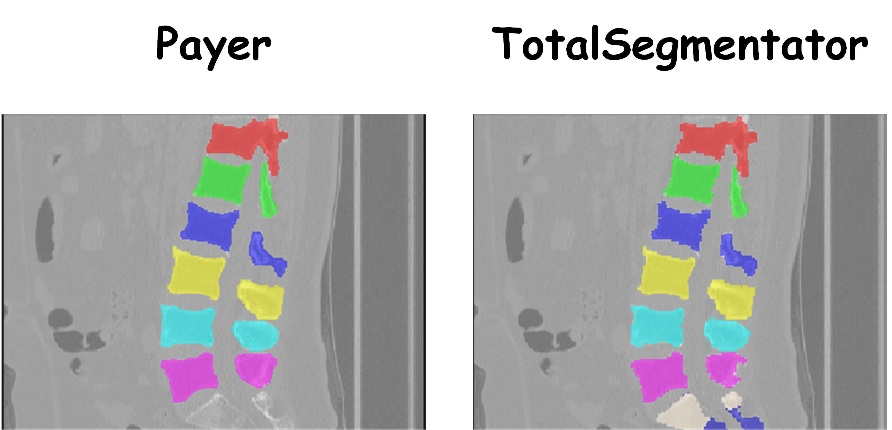

**PayerSeg\_Revised: Improved Fully Automated Spine Segmentation Framework**

## **📖 Project Overview**


**PayerSeg\_Revised** is a deep learning-based system for fully automated spine CT segmentation. This project is an improved and refactored version of the [Coarse to Fine Vertebrae Localization and Segmentation with SpatialConfiguration-Net and U-Net](https://www.scitepress.org/Link.aspx?doi=10.5220/0008975201240133) method proposed by Payer et al., which was the winning solution of the VerSe Challenge.

We have re-engineered the original architecture by consolidating the three independent processing stages into a highly efficient automated inference pipeline. Furthermore, we have **retrained all model weights** using a high-quality **private dataset** to better adapt to specific clinical data distributions, significantly improving prediction accuracy and processing efficiency.

## **🚀 Key Improvements**

1. **Unified Three-Stage Pipeline**:  
   * Refactored the codebase to integrate **Spine Localization**, **Vertebrae Localization**, and **Vertebrae Segmentation** into a single entry script (main\_test\_overlap\_cropped.py).  
   * Implemented automatic data flow between stages, eliminating the need for manual intervention with intermediate results.  
2. **Retraining on Custom Dataset**:  
   * To enhance model performance in specific data scenarios, we retrained all core models (U-Net and SpatialConfiguration-Net) using a proprietary dataset of spine CT scans.  
   * Optimized robustness against various spinal morphologies and pathological conditions.  
3. **Overlap Cropping Strategy**:  
   * Integrated a sliding-window based Overlap Cropping inference mechanism for high-resolution or large field-of-view (FOV) CT scans.  
   * Effectively resolves GPU memory constraints while ensuring segmentation continuity at patch boundaries.  
4. **Engineering Optimizations**:  
   * **Multiprocessing Isolation**: Utilized Python's multiprocessing to solve TensorFlow's GPU memory release and graph conflict issues during multi-stage inference, achieving automatic memory management.  
   * **Automated Result Organization**: Automatically creates independent result directories for each case, classifying and storing heatmaps, landmark projections, and final segmentation files (.nii.gz) for easy visual inspection.

## **🛠️ Technical Architecture**

The system adopts a **Coarse-to-Fine** strategy, divided into three cascaded stages:

1. **Stage 1: Spine Localization**  
   * **Model**: U-Net  
   * **Function**: Rapidly localizes the general spine region at low resolution, generating a spine heatmap and Bounding Box.  
   * **Input**: Raw CT image.  
2. **Stage 2: Vertebrae Localization**  
   * **Model**: SpatialConfiguration-Net (SCN)  
   * **Function**: Precisely locates the centroid of each vertebra within the spine region.  
   * **Post-processing**: Incorporates a **Graph-based Post-processing** model combined with anatomical constraints (e.g., inter-vertebral distance, relative order) to correct false positives and missed detections in the heatmap.  
3. **Stage 3: Vertebrae Segmentation**  
   * **Model**: U-Net  
   * **Function**: Performs fine-grained binary segmentation for each localized vertebra.  
   * **Output**: Merges all single-vertebra segmentation results to generate the final Multi-label Segmentation Mask.

## **📂 Directory Structure**

```Plaintext

PayerSeg\_Revised/  
├── Data/                   \# Data directory (Raw Images & Results)  
├── model\_weights/          \# Pre-trained model weights (Step 1, 2, 3\)  
├── PayerSeg\_Revised2/      \# Core source code  
│   ├── main\_test\_overlap\_cropped.py  \# \[Entry Point\] Runs the full pipeline  
│   ├── main\_spine\_localization...    \# Logic for Stage 1  
│   ├── main\_vertebrae\_localization...\# Logic for Stage 2  
│   ├── main\_vertebrae\_segmentation...\# Logic for Stage 3  
│   ├── dataset\_overlap\_cropped.py    \# Data loading and augmentation  
│   └── network.py                    \# Network architecture definitions  
└── requirements.txt        \# Project dependencies
```
## **💻 Quick Start**

### **Prerequisites**

* Python 3.8+  
* TensorFlow 2.x  
* SimpleITK

### **Run Inference**

Use the main entry script to complete the full prediction process:

```bash

python PayerSeg\_Revised2/main\_test\_overlap\_cropped.py \\  
  \--input\_folder "path/to/raw\_images" \\  
  \--output\_folder "path/to/save\_results" \\  
  \--model\_step1 "path/to/step1\_weights" \\  
  \--model\_step2 "path/to/step2\_weights" \\  
  \--model\_step3 "path/to/step3\_weights"
```

## **📊 Results Structure**

After the program finishes, the following result structure will be generated for each case in the output folder:

* step1\_spine\_localization/: Heatmap predictions of the spine region.  
* step2\_vertebrae\_localization/: Vertebral centroids coordinates (landmarks.csv) and visualization projections.  
* step3\_vertebrae\_segmentation/: Individual vertebrae segmentation results and the final merged \_seg.nii.gz file.

---

## **Acknowledgements** 
This project is an improvement based on the work related to the [VerSe 2020 Challenge](https://github.com/christianpayer/MedicalDataAugmentationTool-VerSe).