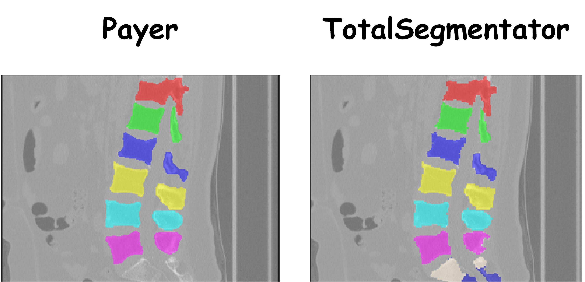

**PayerSeg\_Revised: Improved Fully Automated Spine Segmentation Framework**

## **📖 Project Overview**


**PayerSeg\_Revised** is a fully automated spine CT segmentation system. This project refactors the award-winning pipeline by Payer et al. ([Coarse to Fine Vertebrae Localization and Segmentation with SpatialConfiguration-Net and U-Net](https://www.scitepress.org/Link.aspx?doi=10.5220/0008975201240133)) into a highly efficient, end-to-end inference framework. By retraining the architecture on a high-quality private clinical dataset, we have significantly enhanced prediction accuracy and processing speed compared to the original three-stage method.

Model Link: [Download Models](https://drive.google.com/drive/folders/1nLMXw2zFnWsQlypIAM2z3oIcM8zDxzSi?usp=sharing)
## **🛠️ Technical Architecture**

The system adopts a **Coarse-to-Fine** strategy, divided into three cascaded stages:

1. **Stage 1: Spine Localization**  
   * **Model**: U-Net  
   * **Function**: Rapidly localizes the general spine region at low resolution, generating a spine heatmap and Bounding Box.  
   * **Input**: Raw CT image.  
2. **Stage 2: Vertebrae Localization**  
   * **Model**: SpatialConfiguration-Net (SCN)  
   * **Function**: Precisely locates the centroid of each vertebra within the spine region.  
   * **Post-processing**: Incorporates a **Graph-based Post-processing** model combined with anatomical constraints (e.g., inter-vertebral distance, relative order) to correct false positives and missed detections in the heatmap.  
3. **Stage 3: Vertebrae Segmentation**  
   * **Model**: U-Net  
   * **Function**: Performs fine-grained binary segmentation for each localized vertebra.  
   * **Output**: Merges all single-vertebra segmentation results to generate the final Multi-label Segmentation Mask.

## **📂 Directory Structure**

```Plaintext
PayerSeg_Revised/  
├── Data/                   \# Data directory (Raw Images & Results)  
├── model_weights/          \# Pre-trained model weights (Step 1, 2, 3\)  
├── PayerSeg_Revised2/      \# Core source code  
│   ├── main_test_overlap_cropped.py  \# \[Entry Point\] Runs the full pipeline  
│   ├── main_spine_localization...    \# Logic for Stage 1  
│   ├── main_vertebrae_localization...\# Logic for Stage 2  
│   ├── main_vertebrae_segmentation...\# Logic for Stage 3  
│   ├── dataset_overlap_cropped.py    \# Data loading and augmentation  
│   └── network.py                    \# Network architecture definitions  
└── requirements.txt        \# Project dependencies
```
## **💻 Quick Start**

### **Prerequisites**

* Python 3.8+  
* TensorFlow 2.x  
* SimpleITK

### **Run Inference**

Use the main entry script to complete the full prediction process:

```bash
python PayerSeg_Revised/main_test_overlap_cropped.py \\  
  \--input_folder "path/to/raw_images" \\  
  \--output_folder "path/to/save_results" \\  
  \--model_step1 "path/to/step1_weights" \\  
  \--model_step2 "path/to/step2_weights" \\  
  \--model_step3 "path/to/step3_weights"
```

## **📊 Results Structure**

After the program finishes, the following result structure will be generated for each case in the output folder:

* step1_spine_localization/: Heatmap predictions of the spine region.  
* step2_vertebrae_localization/: Vertebral centroids coordinates (landmarks.csv) and visualization projections.  
* step3_vertebrae_segmentation/: Individual vertebrae segmentation results and the final merged \_seg.nii.gz file.

---

## **Acknowledgements** 
This project is an improvement based on the work related to the [VerSe 2020 Challenge](https://github.com/christianpayer/MedicalDataAugmentationTool-VerSe).